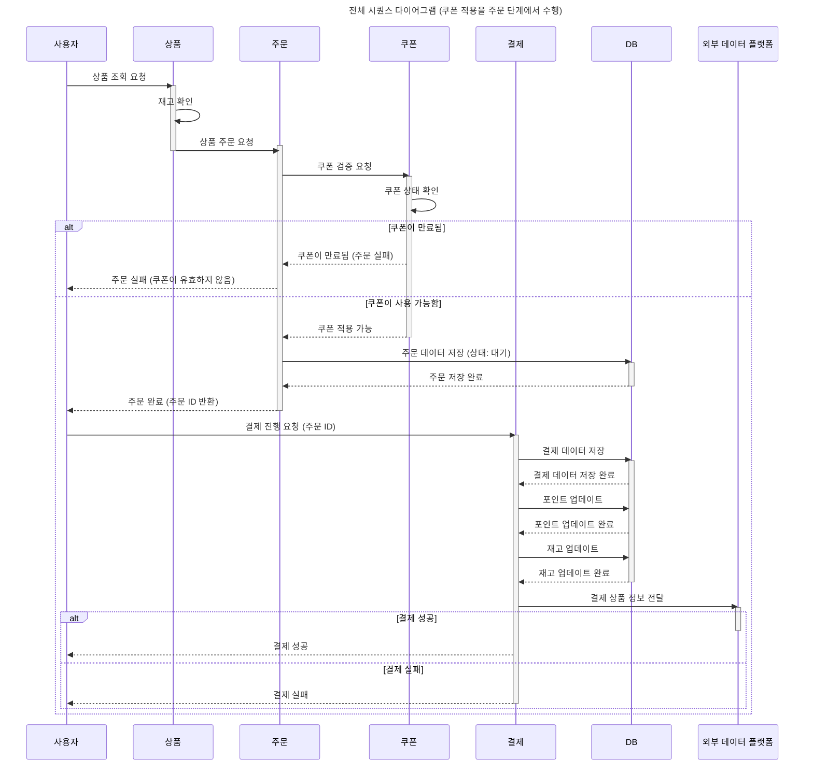

## 상품 주문/결제 서비스 
> 클린 아키텍처 및 DDD 기반으로 설계한 전자상거래 도메인 프로젝트 

- 2025년 3월 22일부터 6월 7일까지 약 10주간 진행한 '항해99' 부트캠프 프로젝트 입니다.
- 상품 등록부터 주문, 결제, 쿠폰, 포인트 충전까지 커머스 시스템의 핵심 기능을 직접 도메인 중심으로 설계하고 구현했습니다.

### ⚙️ 기술 스택 
- Backend: Java/Spring
- DB: MySQL
- ORM: JPA(Hibernate)
- Messaging: Kafka (도입 실습)
- Caching: Redis (도입 실습)
- Testing: k6, JUnit5
- Infra: Docker, Git, GitHub

### 💡 주요 기능 
- ✅ **상품 등록**: 상품 및 인기 상품(Top 5) 등록 및 조회
- ✅ **쿠폰 등록**: 선착순 쿠폰 발급 및 사용자 쿠폰 관리
- ✅ **포인트 충전**: 사용자 포인트 충전 및 사용 내역 관리
- ✅ **주문 기능**: 장바구니 없이 단건 주문 처리
- ✅ **결제 기능**: 포인트를 활용한 결제 처리, 주문과 연동

### 🏗️ 시스템 아키텍처 
1) 클린 아키텍처 레이어 구성 
```
📦 src
├── 📁 domain
│   ├── 📁 coupon
│   │   ├── Coupon.java                  // Entity
│   │   ├── CouponService.java          // 도메인 서비스
│   │   └── CouponRepository.java       // 인터페이스
│   ├── 📁 product
│   │   ├── Product.java                // Entity
│   │   ├── ProductService.java         // 도메인 서비스
│   │   └── ProductRepository.java      // 인터페이스
│   └── ...
│
├── 📁 application
│   └── 📁 facade
│       └── PaymentFacade.java          // 복합 유스케이스 처리
│
├── 📁 infrastructure
│   ├── 📁 coupon
│   │   ├── CouponJpaRepository.java    // Spring Data JPA
│   │   └── CouponRepositoryImpl.java   // Repository 구현체
│   └── ...
│
├── 📁 interface
│   └── 📁 api
│       ├── 📁 coupon
│       │   ├── CouponController.java
│       │   ├── CouponCreateRequest.java
│       │   └── CouponResponse.java
│       ├── 📁 product
│       │   ├── ProductController.java
│       │   ├── ProductRequest.java
│       │   └── ProductResponse.java
│       └── ...


```
2) 시퀀스 다이어그램 - 핵심 기능의 동작 설명


### ✨ 배운 학습 내용 간략 정리 
#### 1. 아키텍처 설계
- 레이어드 아키텍처 → 클린 아키텍처로 구조 확장
- DDD 원칙 기반으로 도메인 중심 설계
- DIP(의존성 역전 원칙)를 고려한 의존성 분리

#### 2. 테스트
- E2E 테스트 (Controller 중심)
- 통합 테스트, 단위 테스트 설계 및 구현
- `Mock`, `Stub` 차이 학습
- k6를 활용한 **부하 테스트** 경험

#### 3. 데이터베이스 설계
- 인덱스 튜닝 시 **카디널리티 고려**
- 비관적 락, 낙관적 락, **분산락** 사용 케이스 학습

#### 4. 캐싱 전략
- Redis 기반 캐시 읽기/쓰기 전략
- **Cache Stampede** 방지 로직 학습 및 구현 실습

#### 5.  Kafka / Redis 도입 실습
- Kafka를 통한 비동기 이벤트 처리 개념 적용
- Redis를 활용한 토큰/세션/카운팅 캐시 적용 실험

#### 🛠️ Running Docker Containers

`local` profile 로 실행하기 위하여 인프라가 설정되어 있는 Docker 컨테이너를 실행해주셔야 합니다.

```bash
docker-compose up -d
```