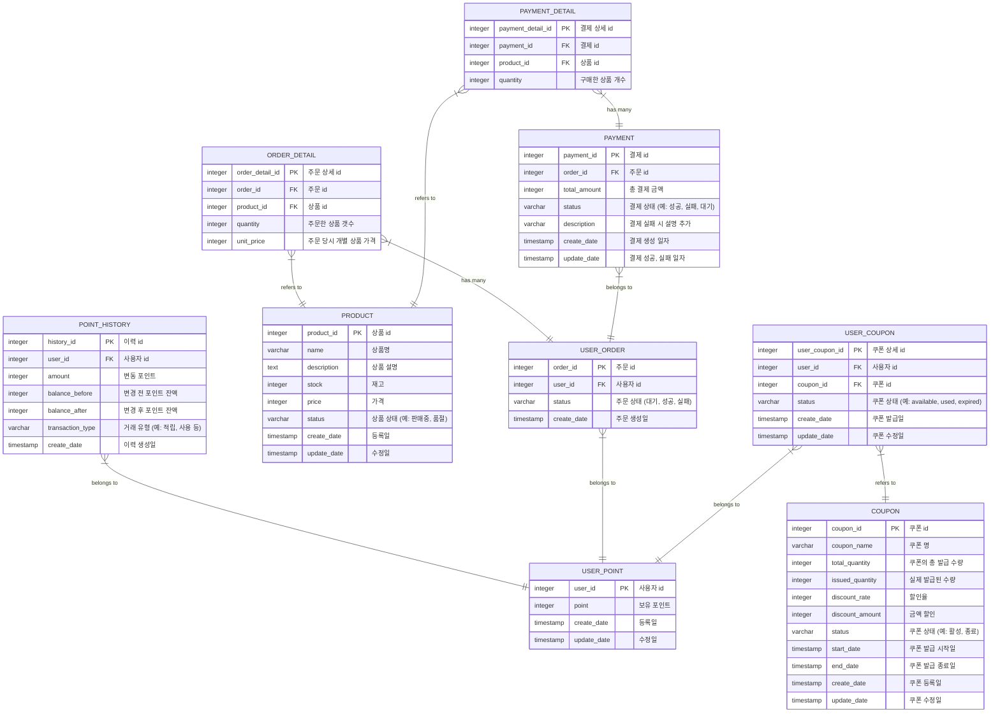

### ERD 설계

```mermaid
erDiagram
  USER_POINT {
    integer user_id PK "사용자 id"
    integer point "보유 포인트"
    timestamp create_date "등록일"
    timestamp update_date "수정일"
  }

  POINT_HISTORY {
    integer history_id PK "이력 id"
    integer user_id FK "사용자 id"
    integer amount "변동 포인트"
    integer balance_before "변경 전 포인트 잔액"
    integer balance_after "변경 후 포인트 잔액"
    varchar transaction_type "거래 유형 (예: 적립, 사용 등)"
    timestamp create_date "이력 생성일"
  }
  POINT_HISTORY }|--|| USER_POINT : "belongs to"

  PRODUCT {
    integer product_id PK "상품 id"
    varchar name "상품명"
    text description "상품 설명"
    integer stock "재고"
    integer price "가격"
    varchar status "상품 상태 (예: 판매중, 품절)"
    timestamp create_date "등록일"
    timestamp update_date "수정일"
  }

  USER_ORDER {
    integer order_id PK "주문 id"
    integer user_id FK "사용자 id"
    varchar status "주문 상태 (대기, 성공, 실패)"
    timestamp create_date "주문 생성일"
  }
  USER_ORDER }|--|| USER_POINT : "belongs to"

  ORDER_DETAIL {
    integer order_detail_id PK "주문 상세 id"
    integer order_id FK "주문 id"
    integer product_id FK "상품 id"
    integer quantity "주문한 상품 갯수"
    integer unit_price "주문 당시 개별 상품 가격"
  }
  ORDER_DETAIL }|--|| USER_ORDER : "has many"
  ORDER_DETAIL }|--|| PRODUCT : "refers to"

  PAYMENT {
    integer payment_id PK "결제 id"
    integer order_id FK "주문 id"
    integer total_amount "총 결제 금액"
    varchar status "결제 상태 (예: 성공, 실패, 대기)"
    varchar description "결제 실패 시 설명 추가"
    timestamp create_date "결제 생성 일자"
    timestamp update_date "결제 성공, 실패 일자"
  }
  PAYMENT }|--|| USER_ORDER : "belongs to"

  PAYMENT_DETAIL {
    integer payment_detail_id PK "결제 상세 id"
    integer payment_id FK "결제 id"
    integer product_id FK "상품 id"
    integer quantity "구매한 상품 개수"
  }
  PAYMENT_DETAIL }|--|| PAYMENT : "has many"
  PAYMENT_DETAIL }|--|| PRODUCT : "refers to"

  COUPON {
    integer coupon_id PK "쿠폰 id"
    varchar coupon_name "쿠폰 명"
    integer total_quantity "쿠폰의 총 발급 수량"
    integer issued_quantity "실제 발급된 수량"
    integer discount_rate "할인율"
    integer discount_amount "금액 할인"
    varchar status "쿠폰 상태 (예: 활성, 종료)"
    timestamp start_date "쿠폰 발급 시작일"
    timestamp end_date "쿠폰 발급 종료일"
    timestamp create_date "쿠폰 등록일"
    timestamp update_date "쿠폰 수정일"
  }

  USER_COUPON {
    integer user_coupon_id PK "쿠폰 상세 id"
    integer user_id FK "사용자 id"
    integer coupon_id FK "쿠폰 id"
    varchar status "쿠폰 상태 (예: available, used, expired)"
    timestamp create_date "쿠폰 발급일"
    timestamp update_date "쿠폰 수정일"
  }
  USER_COUPON }|--|| USER_POINT : "belongs to"
  USER_COUPON }|--|| COUPON : "refers to"
```