### 시퀀스 다이어그램 설계 목적
- 다른 사람과 소통하기 위해서

### 간단한 소개
- 전체 시퀀스 다이어그램과 각 기능별 시퀀스 다이어그램을 나눠서 작성하였습니다.
- [관련 이슈 링크]('https://github.com/Park-ha-neul/hhplus-e-commerce/issues/3')

### 기능별 시퀀스 다이어그램
**전체 시퀀스 다이어그램**
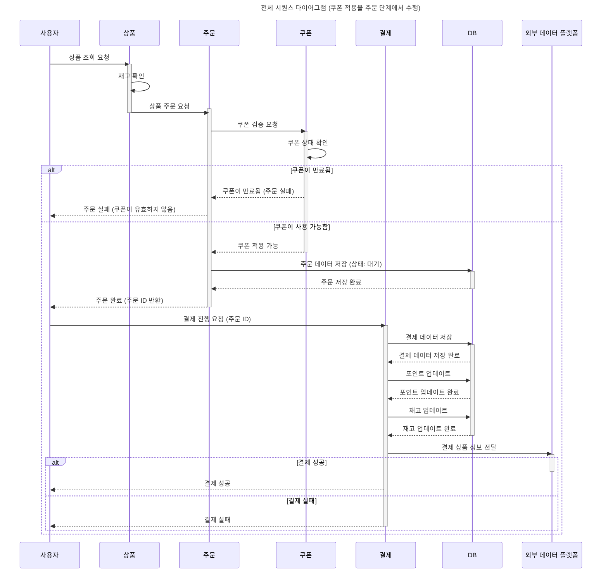

**1. 사용자 잔액**

  
1-1. 잔액 조회

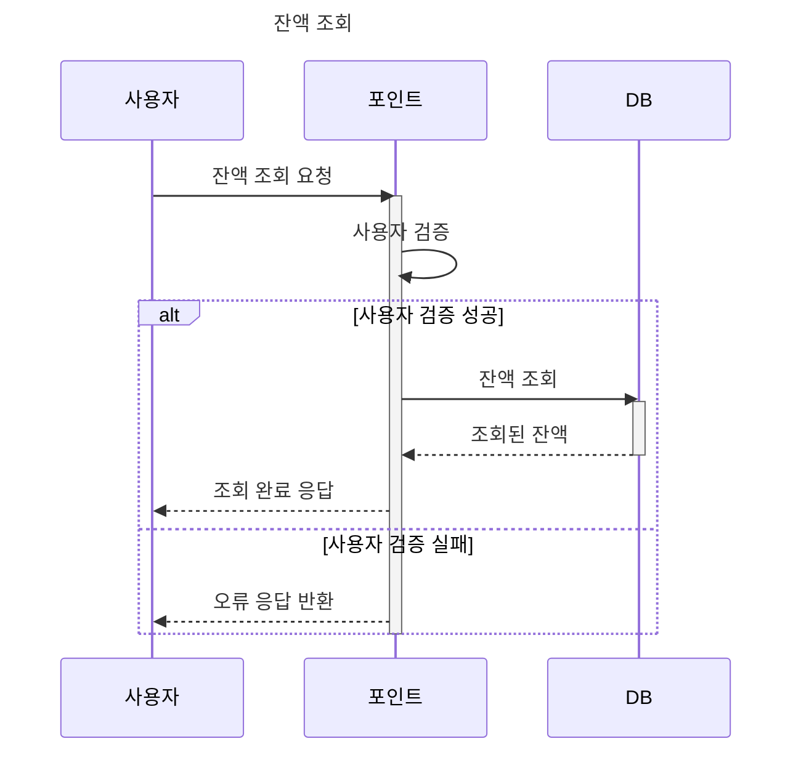

  
1-2. 잔액 충전

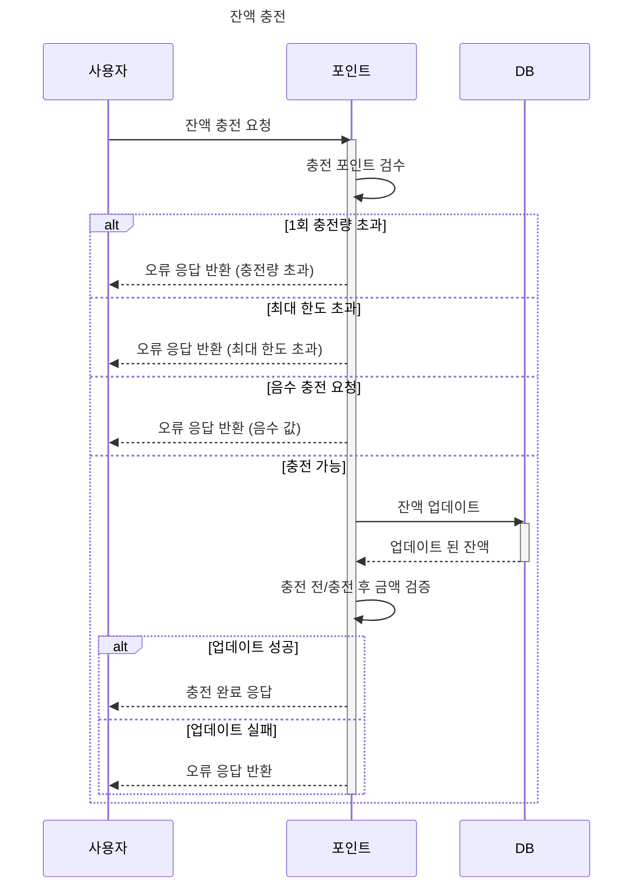

**2. 사용자 상품**

  
2-1. 상품 조회

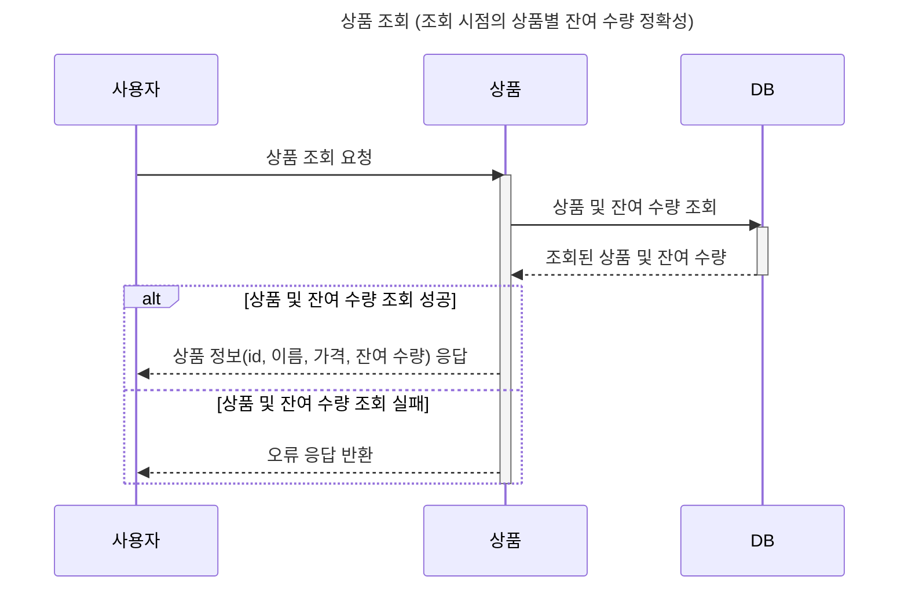

  
2-2. 상품 등록

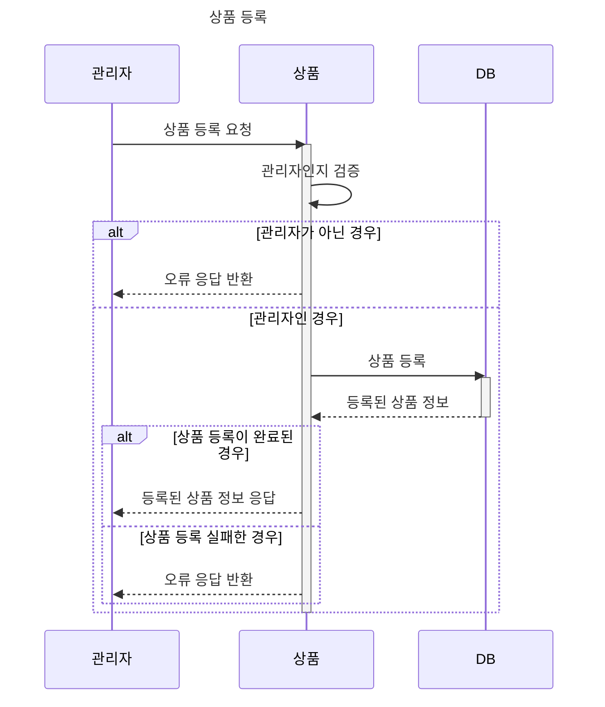

  
2-3. 상품 수정

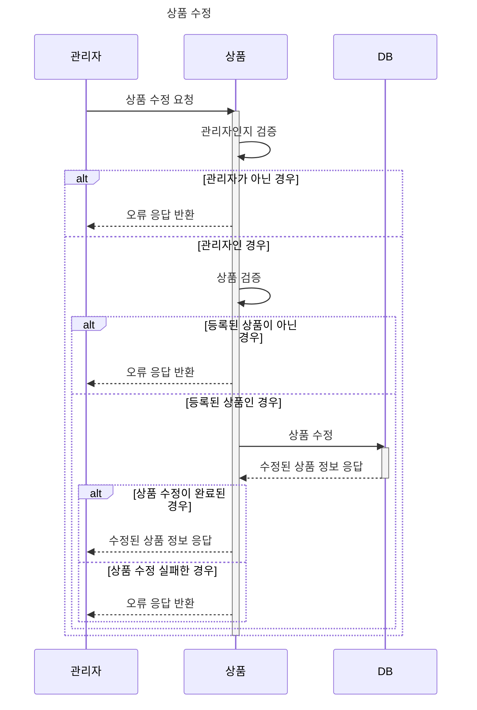

  
2-4. 상품 삭제

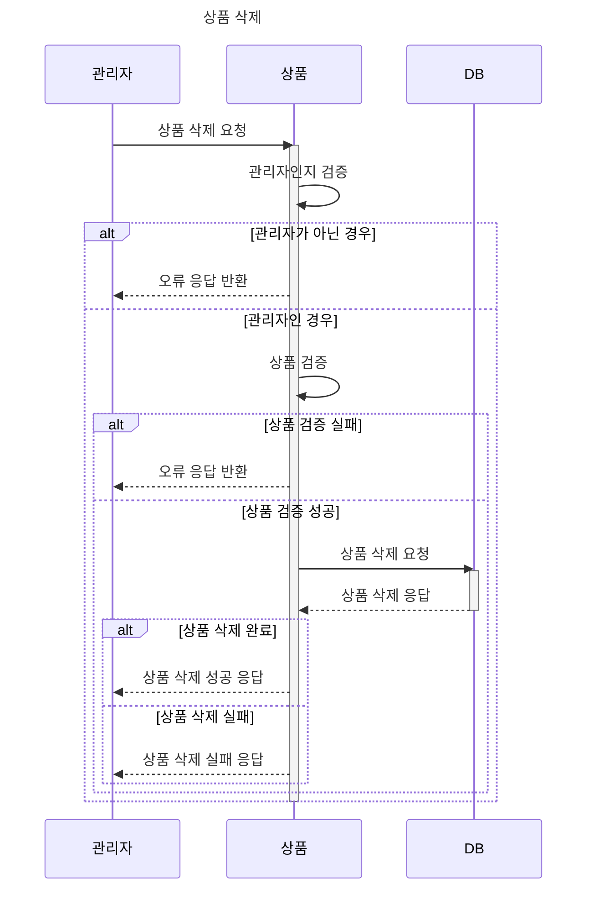

**3. 선착순 쿠폰**

  
3-1. 선착순 쿠폰 등록

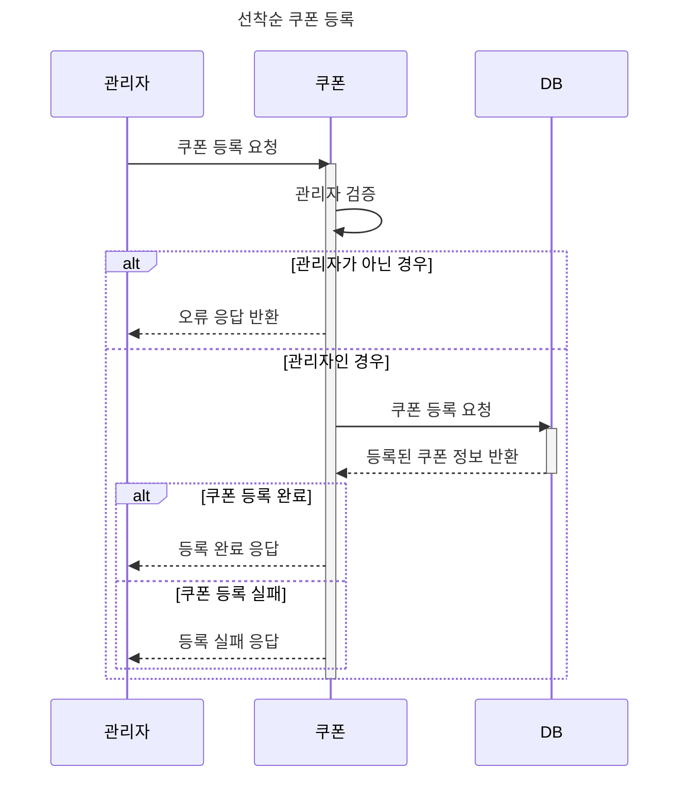

  
3-2. 선착순 쿠폰 발급

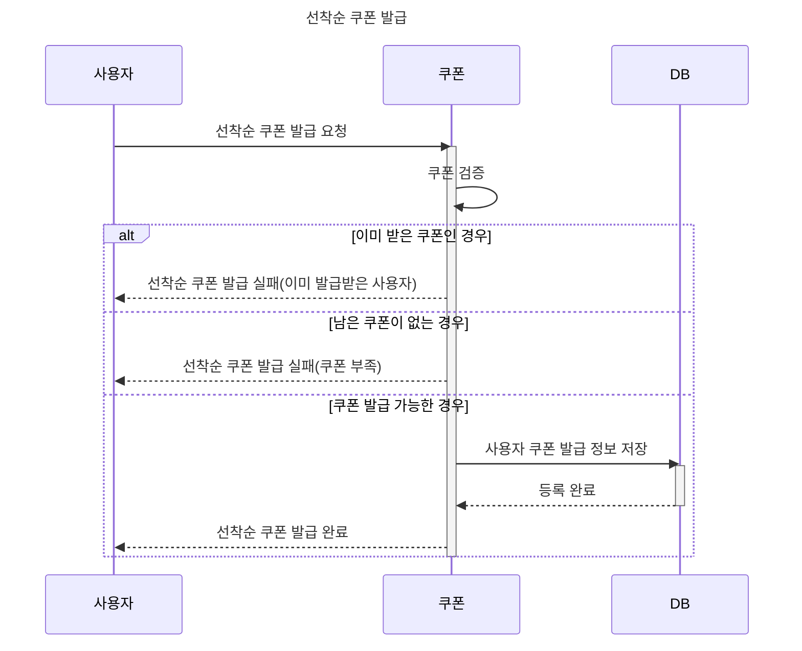

**4. 주문**

  
4-1. 상품 주문

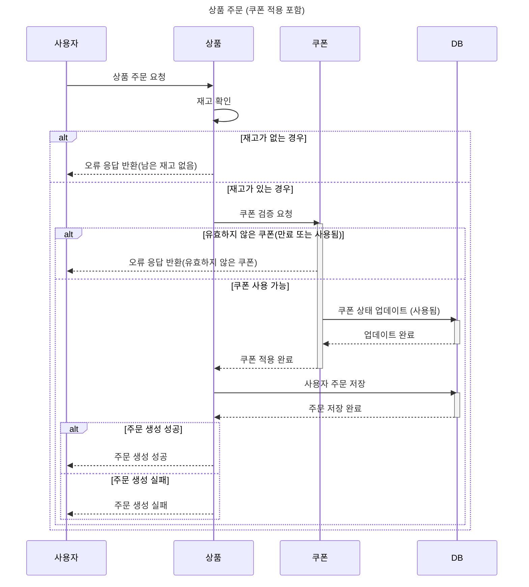

**5. 결제**

  
5-1. 상품 결제

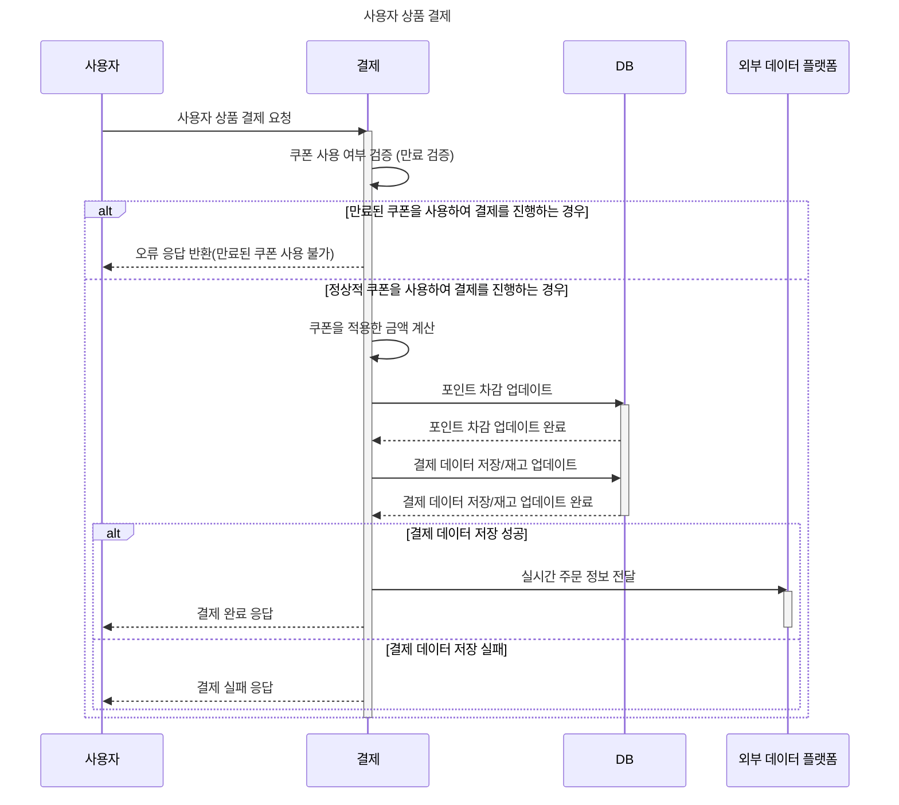

**6. 상위 상품 조회**

    
6-1. 상위 상품 조회

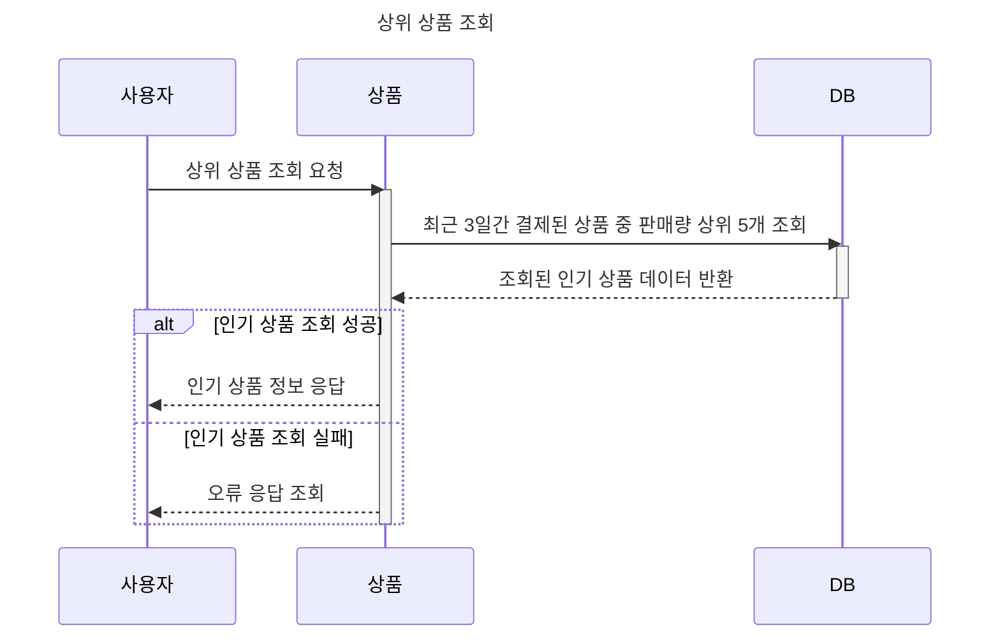

