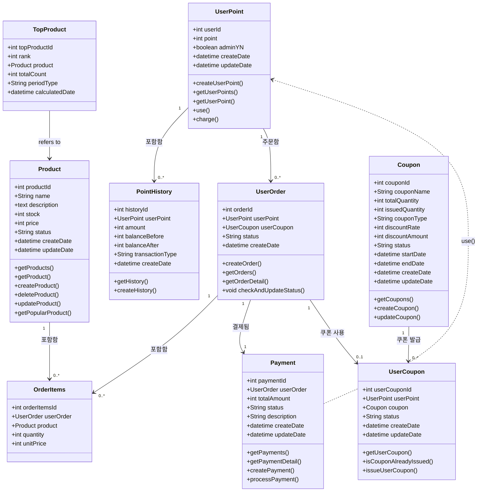

### 클래스 다이어그램 

### 내용 설명 
1️⃣ 포인트(UserPoint)와 관련된 흐름
- `UserPoint`는 사용자의 보유 포인트를 관리
- 사용자의 포인트 변동 내역(사용, 충전)을 `PointHistory`로 기록 
- 사용자가 주문(UserOrder)을 생성할 수 있으며 포인트 사용 가능 
- 결제(Payment) 시 포인트를 사용할 수 있도록 `Payment ..-> UserPoint : user()`로 표현

2️⃣ 주문(UserOrder)과 상품(Product)의 관계
- `UserOrder`는 여러 개의 `OrderItems`을 가짐
- 'OrderItems'은 특정 `Product`를 가리킴 
  - 즉, 하나의 주문 내 여러 개의 상품이 포함될 수 있음

3️⃣ 결제(Payment)와 관련된 흐름
- `UserOrder`는 하나의 `Payment`를 가짐 

4️⃣ 쿠폰(Coupon)의 흐름
- `UserPoint`는 여러 개의 `UserCoupon`을 가질 수 있음
- `Coupon`은 여러 개의 `UserCoupon`으로 발급될 수 있음

5️⃣ 인기 상품 조회 (TOP_PRODUCT)
- TOP_PRODUCT 클래스는 결제 성공 건을 기준으로 산출된 인기 상품 순위를 저장하는 클래스