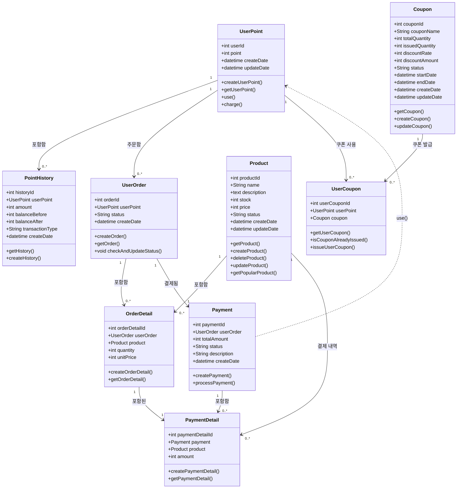

### 클래스 다이어그램 

### 내용 설명 
1️⃣ 포인트(UserPoint)와 관련된 흐름
- `UserPoint`는 사용자의 보유 포인트를 관리
- 사용자의 포인트 변동 내역(사용, 충전)을 `PointHistory`로 기록 
- 사용자가 주문(UserOrder)을 생성할 수 있으며 포인트 사용 가능 
- 결제(Payment) 시 포인트를 사용할 수 있도록 `Payment ..-> UserPoint : user()`로 표현

2️⃣ 주문(UserOrder)과 상품(Product)의 관계
- `UserOrder`는 여러 개의 `OrderDetail`을 가짐
- 'OrderDetail'은 특정 `Product`를 가리킴 
  - 즉, 하나의 주문 내 여러 개의 상품이 포함될 수 있음

3️⃣ 결제(Payment)와 관련된 흐름
- `UserOrder`는 하나의 `Payment`를 가짐 
- `Payment`는 여러 개의 `PaymentDetail`을 가질 수 있음 
- 주문 상세(`OrderDetail`)와 결제 상세('PaymentDetail')는 1:1 관계로 표현됨
  - 즉, 주문 상세 하나당 하나의 결제 상세가 대응됨 

4️⃣ 쿠폰(Coupon)의 흐름
- `UserPoint`는 여러 개의 `UserCoupon`을 가질 수 있음
- `Coupon`은 여러 개의 `UserCoupon`으로 발급될 수 있음

5️⃣ 인기 상품 조회 (Product & PaymentDetail)
- `Product` 클래스는 결제가 완료된 내역 기반으로 인기 상품 조회 
- 최근 3일간 'Payment.status = "성공"' 인 내역을 기준으로 가장 많이 판매된 상품 조회 
- `Product`는 여러 개의 `PaymentDetail`과 관계를 가짐 
  - 이를 통해 특정 기간 동안 결제된 상품 수량 집계 가능 
- `getPopularProduct()` 메서드를 활용해 인기 상품 목록 반환